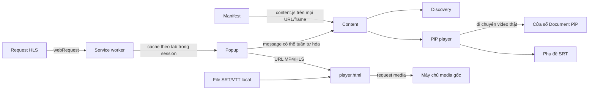

# Kiến trúc

Manifest nạp `content.js` trên `<all_urls>` và mọi frame ở `document_idle`. Popup vẫn thử inject lại bundle trước khi gửi message để hỗ trợ tab đã mở từ trước khi extension được reload; guard trên `window` giúp thao tác này idempotent. Popup không nhận reference DOM. Content script ánh xạ ID tạm thời tới video element, duyệt shadow root mở và iframe cùng origin, chấm điểm candidate rồi tạo cửa sổ Document PiP. `player.ts` lưu parent, sibling, inline style và class gốc, sau đó khôi phục chúng một lần khi PiP phát `pagehide`.

Tài liệu PiP quản lý bộ điều khiển và hiển thị phụ đề. Markup và style tĩnh nằm trong `src/pip/player.html` và `src/pip/player.css`; Vite bundle cả hai vào content script, còn `player.ts` gắn hành vi DOM và quản lý việc di chuyển. Việc hiển thị dùng `requestAnimationFrame`, còn tìm cue dùng binary search. File SRT đã import và track đang active nằm trong session của content script; mở lại PiP trên cùng URL vẫn giữ chúng, còn reload hoặc đổi URL sẽ xóa chúng. Preference toàn extension dùng `chrome.storage.local`.

Service worker quan sát request `.m3u8`, giữ tối đa 10 URL HLS cho mỗi tab trong `chrome.storage.session` và xóa cache khi tab tải trang mới hoặc đóng. Popup ưu tiên URL lấy từ instance hls.js gắn với video đã chọn, sau đó mới dùng cache cấp tab. `player.html` phát MP4/HLS từ URL trực tiếp, nhận SRT/VTT và hiển thị độ phân giải. Request media đi thẳng tới máy chủ nguồn; rule DNR cho `surrit.com` đặt header `Referer` cần thiết.
