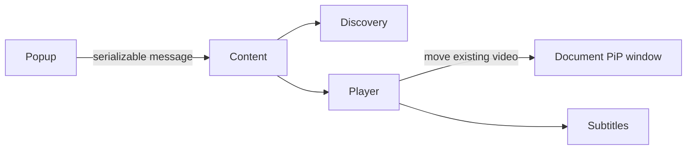

# Architecture

The popup dynamically injects `content.js` into the active tab using `activeTab` and `scripting`; it never receives a DOM reference. The content script maps ephemeral IDs to video elements, traverses open shadow roots, scores candidates, and creates the Document PiP window. `player.ts` captures the original parent, sibling, inline style, and class, then restores them once on PiP `pagehide`.

The PiP document owns controls and subtitle rendering. Its static markup and styles live in `src/pip/player.html` and `src/pip/player.css`; Vite bundles both into the content script, while `player.ts` binds DOM behavior and owns relocation. Rendering uses `requestAnimationFrame`, while cue lookup uses binary search. Imported SRT files and the active track stay in the content script's page session so reopening PiP keeps them, while reloads and URL changes clear them. Preferences use `chrome.storage.local`. Discovery descends into same-origin iframe documents exposed by the page; cross-origin frame isolation remains a documented browser constraint.
