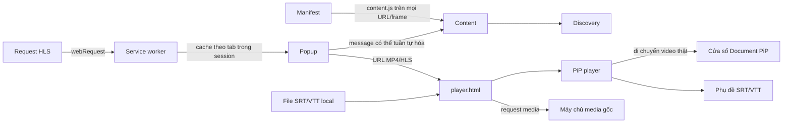

# Kiến trúc

Manifest nạp `content.js` trên `<all_urls>` và mọi frame ở `document_idle`. Popup vẫn thử inject lại bundle trước khi gửi message để hỗ trợ tab đã mở từ trước khi extension được reload; guard trên `window` giúp thao tác này idempotent. Popup không nhận reference DOM. Content script ánh xạ ID tạm thời tới video element, duyệt shadow root mở và iframe cùng origin, rồi chấm điểm candidate để popup chọn nguồn phát.

Tài liệu PiP quản lý bộ điều khiển và di chuyển media từ player page. Markup và style tĩnh nằm trong `src/pip/player.html` và `src/pip/player.css`; `player.ts` gắn hành vi DOM. Khi player page có VTT, video thật mang native text track sang PiP và là nguồn hiển thị phụ đề duy nhất.

Service worker quan sát request `.m3u8`, giữ tối đa 10 URL HLS cho mỗi tab trong `chrome.storage.session` và xóa cache khi tab tải trang mới hoặc đóng. Popup ưu tiên URL lấy từ instance hls.js gắn với video đã chọn, sau đó mới dùng cache cấp tab. `player.html` phát MP4/HLS từ URL trực tiếp, nhận SRT/VTT và hiển thị độ phân giải. Request media đi thẳng tới máy chủ nguồn; rule DNR cho `surrit.com` đặt header `Referer` cần thiết.
